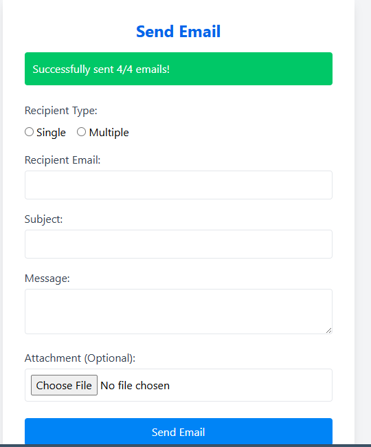

# AI-Powered Bulk Email Sender

An AI-powered Python tool that lets you draft and send personalized bulk emails using **Google Gemini**, with built-in support for file attachments, email tracking, and logging via **Firebase Firestore**. Designed with a clean and simple UI for easy use — perfect for newsletters, campaigns, or internal communication.

---

## Features

- **AI-generated Emails** using Google Gemini API
- **Upload Excel** list of email recipients
- **Attach Files** like PDFs, images, or docs
- **Send via Free Email API** (e.g., Brevo, Mailgun, SMTP)
- **Firebase Firestore Logging**
- **Tracking of Emails**
- Easy-to-use GUI

---

## 📸 Screenshots

**1. Sending Bulk Emails**  


**2. Success Notification (Top Right)**  


**3. Logged Data in Firebase Firestore**  


---

## Demo Video

🎬 **Watch the full demo below:**  
[▶️ Click to Play Demo](Bulk%20Email%20Sender.mp4)

---

## How It Works

1. Upload a `excel` file with email addresses.
2. Enter a prompt for Gemini AI (e.g., “Draft a newsletter for our new product launch”).
3. Optionally attach a file.
4. Click **Send** — emails are generated, sent, and logged.
5. View logs in Firebase Firestore.

---

## Tech Stack

| Function           | Technology       |
|--------------------|------------------|
| Language           | Python           |
| GUI                | Html, Css          |
| AI Integration     | Google Gemini API|
| Email Sending      | Brevo / Mailgun / SMTP |
| Database           | Firebase Firestore |

---

## Author

Built by **Mariyam Chauhdry** – AI Engineer  
Feel free to connect with me on [LinkedIn](https://www.linkedin.com/in/mariyam-chauhdry-592231270)

## Requirements

Install dependencies with:

```bash
pip install -r requirements.txt
---


